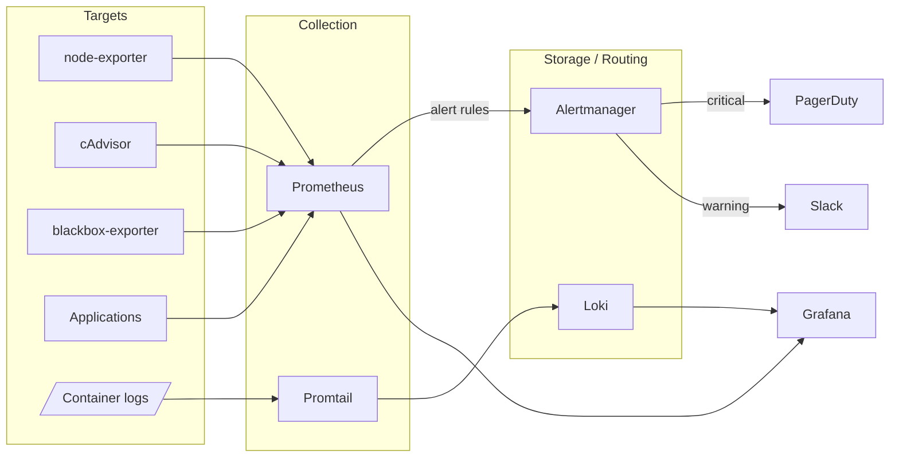

# observability-stack

Complete observability stack — metrics, logs and alerting — that starts locally with a single `docker compose up`. The same configs (Prometheus jobs, alert rules, Loki/Promtail, Alertmanager routing, provisioned Grafana dashboards) translate directly to a Kubernetes deployment.

## Architecture



## Quickstart

```bash
git clone https://github.com/m1r0x1/observability-stack.git
cd observability-stack
docker compose up -d
```

| Service | URL |
|---|---|
| Grafana | http://localhost:3000 (admin / admin) |
| Prometheus | http://localhost:9090 |
| Alertmanager | http://localhost:9093 |
| Loki | http://localhost:3100 |

Grafana comes fully provisioned: Prometheus + Loki datasources and two dashboards (Infrastructure Overview, Application Metrics) load automatically — no clicking.

To actually receive alerts, set the secrets via environment (see `docker-compose.yml`):

```bash
export PAGERDUTY_ROUTING_KEY=... SLACK_WEBHOOK_URL=...
docker compose up -d alertmanager
```

## Alert coverage

| Group | Alerts |
|---|---|
| Host | HighCPU, HighMemory, DiskWillFillIn4Hours, DiskSpaceLow, HostDown |
| Kubernetes | PodCrashLooping, PodNotReady, DeploymentReplicasMismatch |
| Application | High5xxRate (>5% errors), HighLatencyP99 (>1s), EndpointDown (blackbox) |

Routing (`alertmanager/alertmanager.yml`):

- `severity: critical` → PagerDuty (with escalation), repeat every 4h
- `severity: warning` → Slack `#alerts`, repeat every 24h
- Inhibition: a critical alert mutes the matching warning for the same instance.

## CI

`config-validate.yml` runs on every push: `promtool check config/rules`, `amtool check-config` and Loki/Promtail config verification — broken configs never reach main.
